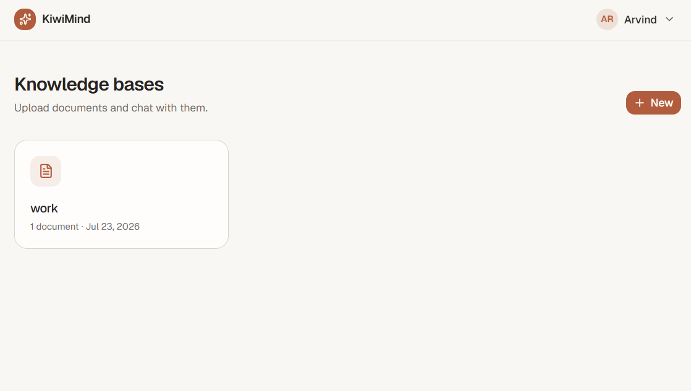
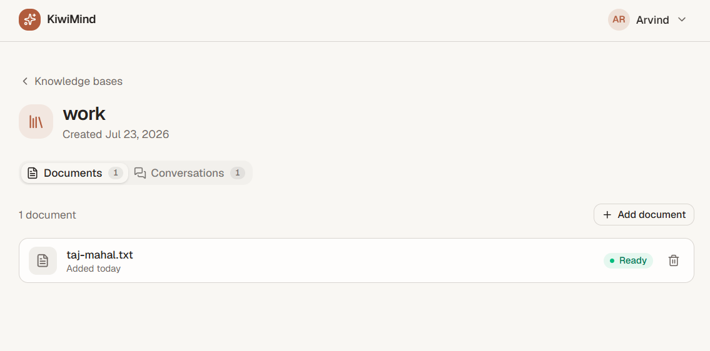
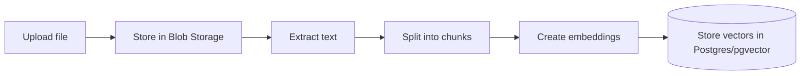
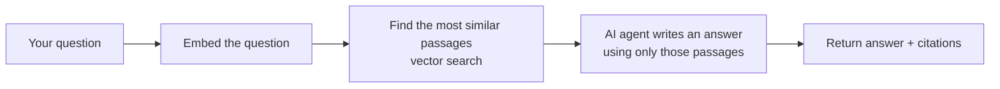
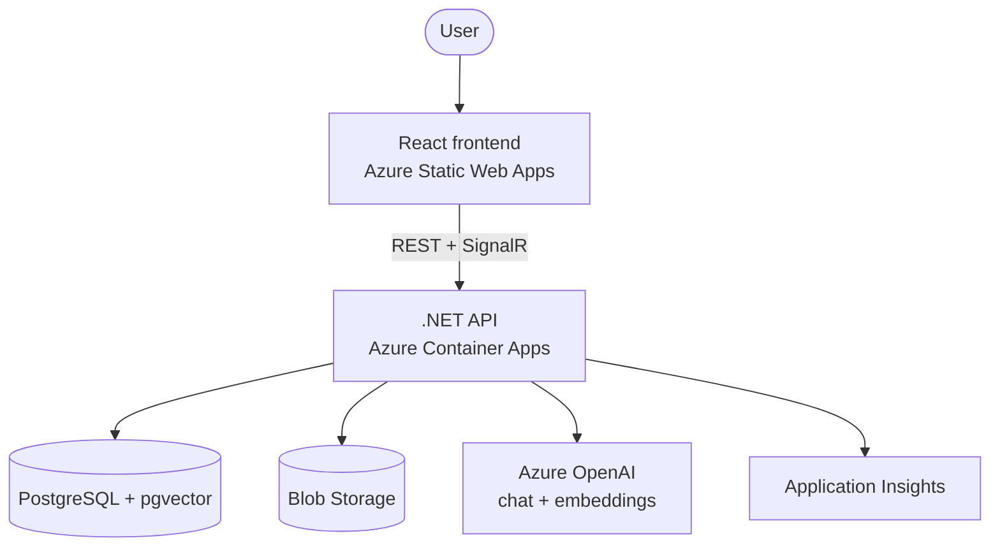

# KiwiMind

**Chat with your documents.** Upload your files, then ask questions in plain English and get answers drawn straight from *your* content — with citations pointing back to the exact source.

### 🔗 [Try the live demo →](https://icy-ocean-0d8e91200.7.azurestaticapps.net/knowledge-bases)

> **Heads-up:** this runs on free/low-cost cloud tiers that "sleep" when idle to save money, so the **first action after a quiet period can take ~10 seconds** to wake up (you'll see a "waking up" message). Everything is snappy after that.

|  |  |
|---|---|
|  |  |
| *Your knowledge bases — collections of documents* | *Inside a knowledge base — uploads with live processing status* |

---

## What is this?

Imagine you have a stack of documents — a contract, a research paper, a policy handbook — and you want answers without reading all of it. KiwiMind lets you:

1. **Upload** your documents (PDF, Word, or text).
2. **Ask** questions in natural language, like *"What year was this signed and by whom?"*
3. **Get answers** written from your documents, with little **citation chips** you can click to see exactly where each fact came from.

It's the same idea behind "chat with a PDF" tools and AI copilots — built from scratch to show how that technology actually works end to end.

**Why it matters:** instead of the AI making things up, every answer is *grounded* in your uploaded content. This technique is called **RAG (Retrieval-Augmented Generation)**, and it's how modern AI assistants stay accurate and trustworthy.

### Try it in 60 seconds
1. Open the [live demo](https://icy-ocean-0d8e91200.7.azurestaticapps.net/knowledge-bases) and register (any email + password — it's a demo, no verification).
2. Create a **knowledge base** (a named collection, e.g. "My Docs").
3. **Upload** a document (a short PDF or `.txt` works great).
4. Start a **conversation** and ask it something. Watch the answer stream in with citations.

---

## What it does (features)

- 🔐 **Secure, multi-tenant** — everyone's documents are private to their own account.
- 📚 **Knowledge bases** — organise documents into named collections to scope what the assistant searches.
- 📄 **Document ingestion** — upload PDF / DOCX / TXT / MD; the app extracts the text, splits it into passages, and indexes them for search (all in the background, with live status).
- 💬 **Grounded answers with citations** — every answer cites the source passage it came from.
- 🤖 **Agentic assistant** — an AI agent that can call multiple tools (search, summarise a document, compare two documents, list what's in a knowledge base) to handle questions a single lookup can't.
- ⚡ **Streaming responses** — answers appear word-by-word in real time.
- 🗂 **Persistent conversations** — chat history is saved per knowledge base.

---

## How it works

KiwiMind is a **RAG pipeline**. Two flows do the work:

**Ingesting a document (background):**



**Answering a question:**



In short: text is turned into **embeddings** (lists of numbers that capture meaning) and stored in a **vector database**. When you ask something, your question is embedded too, the most similar passages are retrieved, and the language model is instructed to answer **only** from those passages — then cite them.

---

## Tech stack

| Area | Technology |
|---|---|
| **Backend** | .NET 10, ASP.NET Core Web API, Clean Architecture + CQRS (MediatR), EF Core (Npgsql) |
| **AI** | Semantic Kernel agent with tool-calling · Azure OpenAI (`gpt-5-mini` for chat, `text-embedding-3-small` for embeddings) |
| **Vector store** | PostgreSQL + `pgvector` (HNSW index, cosine similarity) |
| **Real-time** | SignalR (token streaming) |
| **Frontend** | React 19, TypeScript, Vite, TanStack Query, Tailwind CSS v4, shadcn/ui |
| **Auth** | JWT access/refresh tokens, multi-tenant isolation |
| **Cloud** | Azure Container Apps (API), Azure Static Web Apps (frontend), Blob Storage, PostgreSQL Flexible Server |
| **Infrastructure as Code** | Bicep |
| **CI/CD** | GitHub Actions (build → test → deploy) |
| **Observability** | OpenTelemetry → Azure Application Insights |
| **Testing** | xUnit, Testcontainers, and a RAG evaluation harness (groundedness scoring) |

---

## Architecture



The backend follows **Clean Architecture** — the domain and application logic don't depend on any infrastructure. **The live demo runs on real Azure OpenAI** (`gpt-5-mini` for chat, `text-embedding-3-small` for embeddings). Because those providers sit behind interfaces (`IEmbeddingService`, `IChatCompletionService`), the same code also has deterministic **fake** implementations that kick in when no Azure OpenAI config is present — so anyone can run the entire pipeline locally with **zero AI cost or API keys**, and Azure OpenAI could be swapped for a local model without touching business logic.

---

## Engineering highlights

A few things worth calling out for a technical review:

- **Provider-agnostic AI** — real Azure OpenAI and offline fake implementations sit behind the same interfaces, toggled by config. Local development needs no cloud credentials.
- **Native vector search** — embeddings are stored as `pgvector` columns so cosine similarity runs in SQL (with an HNSW index), not in application memory.
- **Agentic tool-calling** — a Semantic Kernel agent chooses among tools (`search_knowledge_base`, `summarize_document`, `compare_documents`, `get_document_metadata`, `list_documents`) rather than doing a single fixed retrieval.
- **RAG evaluation harness** — a Testcontainers-backed test suite scores answer *groundedness* against a golden dataset, catching hallucination regressions.
- **Resilient ingestion** — background worker with startup reconciliation (in-flight jobs are re-queued after a restart), batched embedding calls, and per-user quotas.
- **Production concerns** — rate limiting, upload size limits, multi-tenant query filters, managed-identity image pulls, and full request tracing to Application Insights.

---

## Running locally

**Prerequisites:** Docker, .NET 10 SDK, Node 22+.

```bash
# 1. Start Postgres (with pgvector) + Azurite (blob emulator) + the API
docker compose up --build -d      # API on http://localhost:8080

# 2. Start the frontend
cd frontend
npm install
npm run dev                       # http://localhost:5173
```

Out of the box it uses the **fake** AI providers — no API keys required — so the full upload → search → chat loop works offline. To use real Azure OpenAI, set the `AzureOpenAI__*` configuration values.

**Run the tests** (includes the Testcontainers-backed RAG evaluation):

```bash
dotnet test
```

---

## Deployment

Everything is provisioned on Azure with **Bicep** (`infra/`) and deployed by **GitHub Actions** on every push to `main`: build → test → containerise the API → push to Azure Container Registry → update Container Apps, and deploy the frontend to Static Web Apps.

To keep costs near zero, the demo uses free/low tiers, Container Apps **scale-to-zero**, and the smallest Postgres tier.

---

## Project structure

```
src/
├── KiwiMind.Domain          # Entities, enums — no dependencies
├── KiwiMind.Application      # CQRS handlers, interfaces (the "what")
├── KiwiMind.Infrastructure   # EF Core, pgvector, Azure OpenAI, Blob, agent (the "how")
└── KiwiMind.Api              # Controllers, JWT, SignalR hub, DI
frontend/                     # React + TypeScript app
tests/                        # Unit, integration, and RAG-evaluation suites
infra/                        # Bicep IaC
.github/workflows/            # CI/CD
```

---

*Built as a portfolio project to demonstrate modern AI engineering (RAG, embeddings, agentic tool-calling) on Azure-native cloud infrastructure.*
